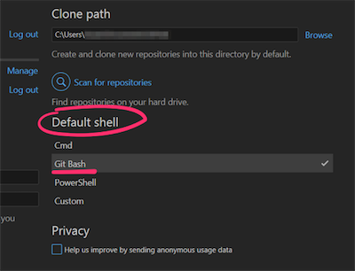
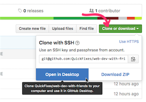

# Full-stack Web Development—with Friends

Learn to build and share a ready-to-rock GNU/Linux virtual machine image with
your team, including a complete <strike>graphical</strike> development
environment, all necessary packages, and a preloaded, running "starter" web
application, accessible from a browser in the host OS.

Once the VM is provisioned running, you can access a sample static web site
from the "host" OS on [localhost:9980][lh9980] as well as a JavaScript-based
to-do list application (based on [TodoMVC][todomvc]) on
[locahost:9981][lh9981].

The former (cloned from [this repo][dancemoves])
demonstrates how a remote repository may be [cloned using Git][ansiblegit]
during the Ansible "provisioning" process. The latter demonstrates how you
might serve web content from the cloned repository _on the host OS_, using
Vagrant's [`config.vm.synced_folder` directive][vagrantsyncedfolder] (see
`Vagrantfile` around [line 49][vagrantfilel49]). This allows you to do your
development work from the host OS, using your favorite editor, or create
a self-contained and self-hosted repository for showing off your project.

For instructions for accessing the VM over [SSH][wpssh], see the
"[Authentication](#authentication)" section, below. For technical details on
the VM provisioning setup, please see [`TECHNICAL.md`](TECHNICAL.md).

## Installation

Every OS is going to require at a minimum:

* a [UC GitHub Enterprise][ucgh] or [GitHub.com][gh] account
* [VirtualBox] - a way to run "virtual machines"
* [Vagrant] - a way to automate the creation/setup of VMs

### Quick start

If you already know how to clone a repository from GitHub, then clone this
repository (`web-dev-with-friends`) to your computer and following the steps
below.

Once all the provisioning steps are completed, you will be able to access one
of the sample web sites at [localhost:9980][lh9980] or [:9981][lh9981] from the
"host" operating system.

On **Windows**:

1. Install (at a minimum) VirtualBox and Vagrant, as noted above
2. Open a command prompt inside the `web-dev-with-friends` respository you just
   cloned (in Explorer, you can Shift+right click on the directory and pick
   "Open command window here"; [screenshot][cmdhere])
3. type in `setup.cmd` and press ENTER
4. visit [localhost:9980][lh9980] in a web browser on the host OS

On **Unix-like operating systems** (macOS / Linux):

1. Install (at a minimum) VirtualBox and Vagrant, as noted above
2. Inside a terminal, `cd` to where you cloned the `web-dev-with-friends`
   repository
3. run `./setup.sh` to start the installation
4. visit [localhost:9980][lh9980] in a web browser on the host OS

macOS (the OS formerly known as OS X) and most GNU/Linux distros will already
have Git install installed. However, if you get an error on Linux when you type
`git` at the command line, then install `git` (possibly `git-core`) from the
distro's package manager.

### Detailed instructions for Windows

It's sufficient to run `setup.cmd` in Windows' built-in Command Prompt, but in
order to work most productively with the VM image created by this repository,
you'll want a "genuine" [Unix shell][shell] that provides the OpenSSH `ssh`
binary.

_Learning how to use the Unix shell (e.g., Bash) is beyond the scope of this
workshop, but you can find some resources [here][artofcmdline]._

The easiest way to get started is by by installing the
[GitHub GUI][ghguiwin], which can be easily configured to provide a Bash
shell you can use to connect to the running VM.

Once installed, change the GitHub GUI settings as shown below:

Then browse to this repository (`web-dev-with-friends`)
[on github.com][thisrepogh] or [on github.uc.edu][thisrepouc] and click the
"Clone or download" button, followed by "Open in Desktop":

After that, you can right click on the repository in the left panel of the GUI,
and choose

### Detailed instructions for macOS (née OS X)

With the Mac operating system (formerly known as OS X or Mac OS X), you
already have all the software you need to clone the repository from the
command line. Search using Spotlight (⌘ + space) for "terminal" if you
don't know where Terminal.app is found.

You might still prefer starting with the [GitHub GUI for Mac][ghguimac], and
that's fine. If you use the GitHub GUI on Mac, you can follow the same basic
steps as for Windows, above, to clone the `web-dev-with-friends` repo from the
web. You don't need to configure the "Git Bash" shell, because macOS is a Unix
operating system, and already comes with the Bash shell.

Installation packages for Vagrant and VirtualBox are, however, still required
on a Mac; see above for links to the main project sites.

### Detailed instructions for GNU/Linux

On GNU/Linux, you'll want to _at a minimum_ install the `git-core` or `git`
[package] from your OS's package manager. [`git-cola`][gitcola] or `gitg`
would be good choices if you'd like a GUI.

Then, just paste these commands

    cd ~/path/to/your/dev/stuff
    git clone git@github.com:QuickFixes/web-dev-with-friends.git
    cd web-dev-with-friends
    ./setup.sh

into a terminal, replacing `git@github.com` with `git@github.uc.edu` if you are
a UC student and don't have a GitHub.com account (since this repository exists
in both places).

Precompiled packages for both Vagrant and VirtualBox should exist in some form
in the "contrib" or "universe" repositories of your Linux distribution. As of
this writing, however, it's best to use the installation instructions on the
[main project site][vagrant] (installing with `pip`), because you'll run into
problems with some of the older versions. (Give them a few years to sort out
these kinks, it's a relatively young project.)

## Connecting to the running VM

### Authentication

You will connect to the running virtual machine over SSH as the user
`vagrant`. This user is in the `sudoers` file (by way of being a
member of the group `sudo`), which means it can become the superuser (`root`)
with no password.

The Vagrant user's default password is `vagrant`.

If you have any problems with authentication, please refer to 
[`TECHNICAL.md`](TECHNICAL.md).

### Connecting to the VM over SSH

In order to connect with the VM over SSH, normally you would just type
`vagrant ssh` inside the "root" of this repository, wherever you originally
cloned it.

An error message to the effect of "Run \`vagrant init\` to create a new
Vagrant environment" usually means that you were in a subdirectory and forgot
to `cd` into the top level of the repository (where the
[`Vagrantfile`](Vagrantfile) lives) before running `vagrant up` or `vagrant
ssh`.

![That's better.][vagrantright]

The `vagrant` command expects to be run in the same working directory as where
the [`Vagrantfile`](Vagrantfile) lives, so that it can read the
configuration directives for the VM before attempting to start/provision it.

On Windows, you need to run this command inside of a Bash (or [Cygwin][])
shell, which the GitHub GUI for Windows provides, as long as you correctly
followed the instructions above.

You'll find additional advice about connecting over SSH (including using SFTP
programs like [Cyberduck][]) in [`TECHNICAL.md`](TECHNICAL.md).

### Forwarded ports

The [`Vagrantfile`](Vagrantfile) will automatically create the following
forwarded ports for you. 

| Guest (VM) port forwards to...  | Host port #      | Notes                    |
| ------------------------------- | ---------------- | ------------------------ |
| 22                              | 9922             | Secure Shell (see below) |
| 80                              | [9980][lh9980]   | Apache HTTP server       |
| 81                              | [9981][lh9981]   | Apache HTTP server       |
| 5000                            | [55000][lh55000] | Python / Flask app       |

It was after some deliberation that I decided to stick with 55000 for the
Flask server, so that it wouldn't interfere with the default configuration of
a local Flask server you might be experimenting with. Just make a bookmark to
<http://localhost:55000> and remember that it goes with the Flask app running
on the VM.

## Frequently-asked Questions

### What about Windows? ###

> Yes, what about Windows, indeed.

> That's part of the reason why this repository exists: to give your team
> a consistent working environment, independent of their "preferred" OS.

> However, since Windows lacks a sensible built-in command line and most of
> the tools necessary to do "full-stack" web development using open source
> technologies, you need a mishmash of software to fill in the gaps.

> Graphical Git clients such as the official GitHub GUI and [SourceTree][]
> help alleviate some of the pain of setting this all up, by bundling a
> functional Unix shell. The virtual machine you'll get after running the
> setup script in this repository is designed to provide everything you need
> to get _started_ with PHP or Python web development on the Apache HTTP
> server.

### What is this "Vagrant" thing and why is it necessary? ###

> It's not.
>
> But it saves you from having to distribute a potentially very large VM image
> to your team, which you have spent hours of your life custom crafting for
> _one_ GNU/Linux distribution's release, with _one_ specific purpose in mind.
>
> By putting these instructions in configuration files (which can be
> version-controlled with Git), you can build similar virtual machines
> for different projects with slightly different requirements **without
> duplicating all that effort**.

### What is this "Ansible" thing and why is it necessary? ###

> It's not.
>
> But it saves you from having to manually install a dozen different software
> packages, copy default configuration files, deployment SSH keys, or whatever
> else, over and over and over again, for each new project.
>
> Using [Ansible][] allows you to record these steps in a
> mostly-human-readable [YAML][] configuration file, which you can just clone
> and modify for your next project.

> These configuration files are like having _really_ comprehensive,
> version-controlled notes on everything you did to set up your development /
> hosting environment, and they can even be lightly modified to apply the same
> steps to a cloud-based host (Amazon AWS or a similar competitor).

### What is this "veewee" thing and why is it necessary? ###

> It's not.
>
> But it provides you with a complete blueprint of how to set up a virtual
> machine development environment for your team—beginning from the distro's
> installation ISO.
>
> This could come in handy if the Vagrant `.box` image (that you spent hours of
your life getting _just_ right) became corrupted, or > was otherwise lost
through some data storage disaster.
>
> There is no requirement for anyone on your team to perform the steps
> discussed in [`TECHNICAL.md`](TECHNICAL.md) to rebuild the base box,
> but it saves *you* time when you make a clone of this repository for your
> _next_ project.
>
> Keep in mind, too, that this repository is a few hundred kilobytes. If your
> team is patient and doesn't mind downloading a 4.7 GB installation ISO, you
> actually don't even have to host the [Vagrant "base box"][basebox] anywhere
> on the 'net.

## References

1. Incorporates the ["VanillaJS" example][todovanilla] from the
   [TodoMVC project][todomvc] at revision [635fd9f][todomvcrev]  

[thisrepouc]: https://github.uc.edu/QuickFixes/web-dev-with-friends
[thisrepogh]: https://github.com/QuickFixes/web-dev-with-friends
[ucgh]: http://github.uc.edu
[gh]: https://github.com/login
[ghguiwin]: https://windows.github.com
[ghguimac]: https://mac.github.com
[virtualbox]: https://virtualbox.org
[vagrant]: https://vagrantup.com
[todovanilla]: http://todomvc.com/examples/vanillajs/
[todomvc]: https://github.com/tastejs/todomvc  
[todomvcrev]: https://github.com/tastejs/todomvc/commit/635fd9f79d9c12d731a968cd35a535e25c2f4e71
[cmdhere]: http://mingersoft.com/blog/2011/02/open-a-command-prompt-quickly-in-windows-7/
[shell]: https://en.m.wikipedia.org/wiki/Unix_shell
[artofcmdline]: https://github.com/jlevy/the-art-of-command-line
[ghfork]: https://help.github.com/articles/fork-a-repo/
[gitcola]: https://git-cola.github.io/index.html
[yaml]: https://en.m.wikipedia.org/wiki/YAML
[ansible]: https://docs.ansible.com/
[ansiblegit]: https://docs.ansible.com/ansible/git_module.html
[basebox]: https://www.vagrantup.com/docs/boxes/base.html
[cygwin]: http://cygwin.org/
[cyberduck]: https://cyberduck.io/
[vagrantwrong]: img/vagrant_up_in_wrong_directory.png
[vagrantright]: img/vagrant_up_in_right_directory.png
[sourcetree]: https://www.sourcetreeapp.com/
[lh9980]: http://localhost:9980
[lh9981]: http://localhost:9981
[lh55000]: http://localhost:55000
[dancemoves]: https://github.com/QuickFixes/qf1-dancemoves 
[wpssh]: https://en.m.wikipedia.org/wiki/Secure_Shell
[vagrantsyncedfolder]: https://www.vagrantup.com/docs/synced-folders/basic_usage.html
[vagrantfilel49]: Vagrantfile#L49
